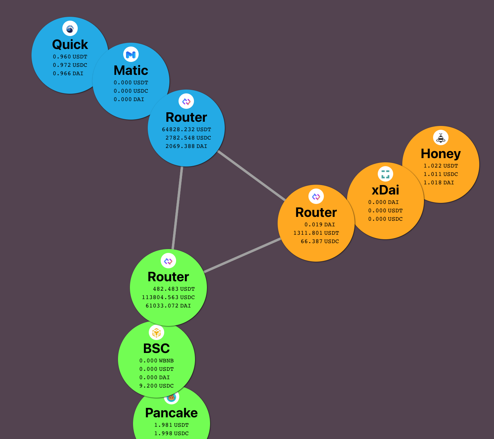

# Interaktive Layer2 Overview



It is difficult to keep track of how much of your money is currently in which chain. And a lot of work to move the right currency where you want to use it.

This project has both an educational purpose of learning how different chains work side by side and a potential use in your daily L2 activities.

## Get started

```
git clone https://github.com/makoto/layer2-overview
cd  layer2-overview/packages/react-app
yarn
yarn start
```

## Chains and exchanges supported

- [PancakeSwap](https://pancakeswap.finance) on [Binance Smart Chain](https://www.binance.org/en/smartChain)
- [QuickSwap](https://quickswap.exchange) on [Matic/Polygon](https://polygon.technology)
- [HoneySwap](http://honeyswap.org) on [xDAI](https://www.xdaichain.com)

## API used

- [Connext](https://connext.network/) = State channel based cross chain bridge technoloy.
- [TheGraph](https://thegraph.com/) to call each chain's token prices
- [Web3 Modal]() = to allow you to connect via Metamask, Walletconnect, and Portis. WARNING: Do you access via smartcontract based wallet like Argent and Gnosis safe, as their wallet address is not compatible across different chains.
- [Portis](https://portis.io/) = Portis supports both xDAI and Matic (not BSC yet). To connect to the specific chain, go to the swap page (/exchange/*), then disconnet/connect
- [BitQuery](https://bitquery.io/) = To show transaction history of Binance smart chain
- [Covalent](https://www.covalenthq.com) = To show transaction history of Matic


## Credits

This project is inspired by [Makoto Inoue](https://github.com/makoto)'s project [Off L1](https://github.com/makoto/off-l1).